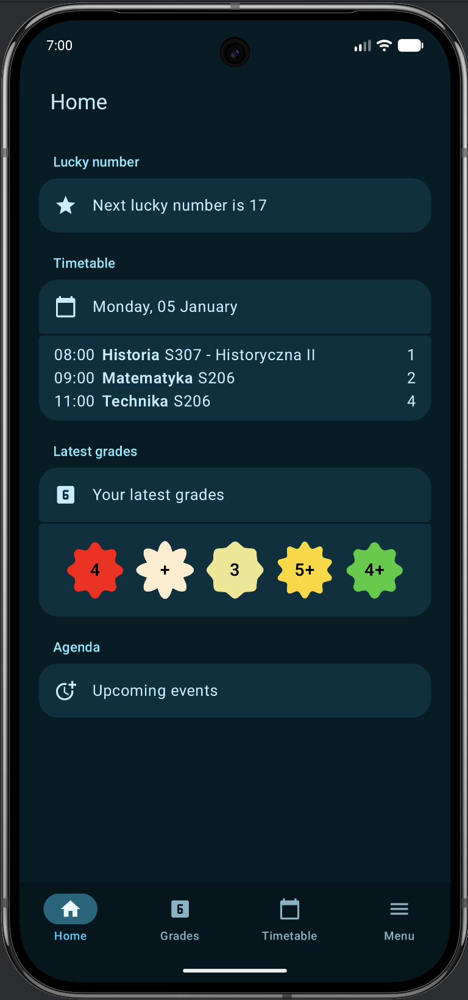
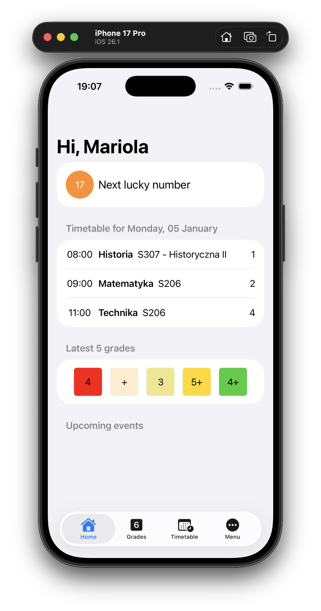

# Violet
Multiplatform custom client for one of the polish school e-diaries.

## Preview

## Implemented functions
- Grades info and averages:
    - yearly
    - per semester
    - per subject by semester

## Builds
- Releases tab
- [Nightly](https://nightly.link/aeoliux/Violet/workflows/build/main?preview) - without Liquid Glass on iOS (unsupported by GitHub Actions)
